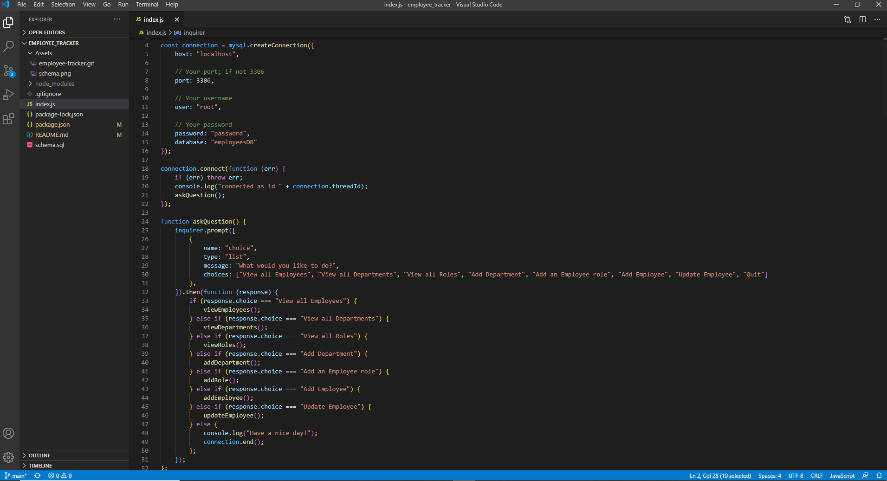

# Employee Tracker!

## Description
This program allows the user to view and manage departments, roles, and employees in their company to plan and organize the business.
        
## Table of Contents
- [Installation](#installation)

- [Usage](#usage)

- [License](#license)

- [Video](#video)

- [Test](#test)

- [Contributors](#contributors)

- [Questions](#questions)

    
## Installation
npm inquirer and npm mysql must be installed through the integrated terminal to use the program.

## Usage
Once the program is opened, right click on index.js and type the following command npm init -y, once the installation is complete the user must install the npm packages, type the command npm install inquirer, wait for that to finish then install mysql by typing npm install mysql. Once all packages have been installed, type node index.js to be prompted with a menu to organize their company.
        
## License
This project uses MIT

## Video

## Test
No tests are needed.

## Contributors
Jae Kim

## Questions
View my other projects!

https://github.com/JSK321

Have any questions?

Email me at: Jaeshinkim321@gmail.com